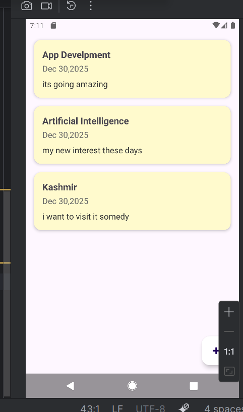
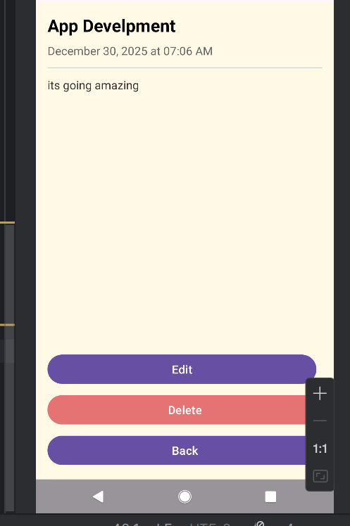
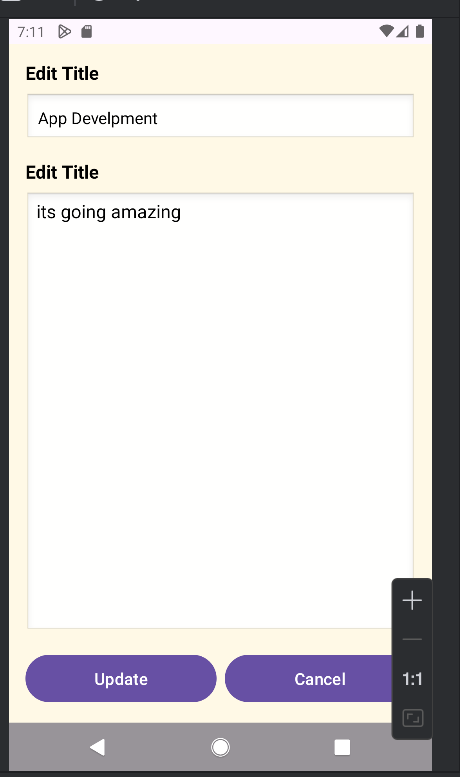
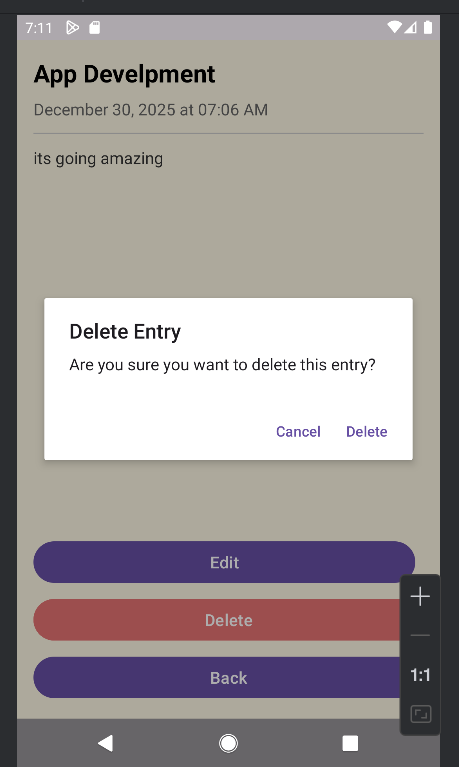

# MyJournalApp

MyJournalApp is an Android app developed in Java that allows users to create, view, edit, and delete personal journal entries. It uses **Room Database** for local storage and **RecyclerView** to display entries in a clean and organized way.  

---

## Features

- View all journal entries with titles and content displayed in a list.
- Click on an entry to view it in detail with **Edit**, **Delete**, and **Cancel** options.
- Edit existing entries using the **Edit screen**.
- Delete entries with a **confirmation alert dialog**.
- Add new journal entries using a **floating action button**.
- Smooth navigation between screens with intuitive back button functionality.

---

## Screenshots

### Main Screen


### View Entry Screen


### Edit Entry Screen


### Delete Confirmation Popup


---

## Tech Stack

- **Language:** Java  
- **Database:** Room Database  
- **UI Components:** RecyclerView, FloatingActionButton, AlertDialog  
- **Platform:** Android Studio  

---

## How to Run

1. Clone this repository:  
```bash
git clone https://github.com/YourUsername/MyJournalApp.git
